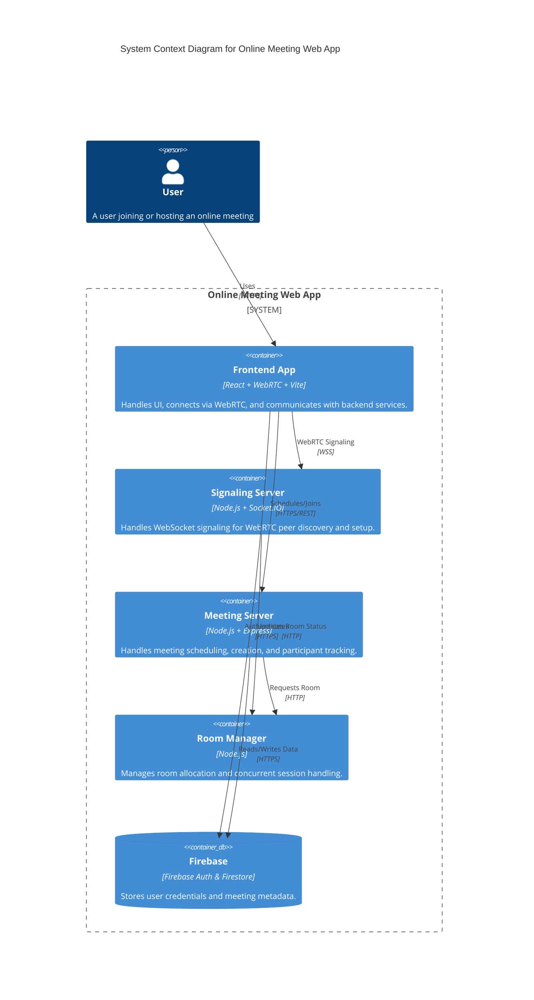
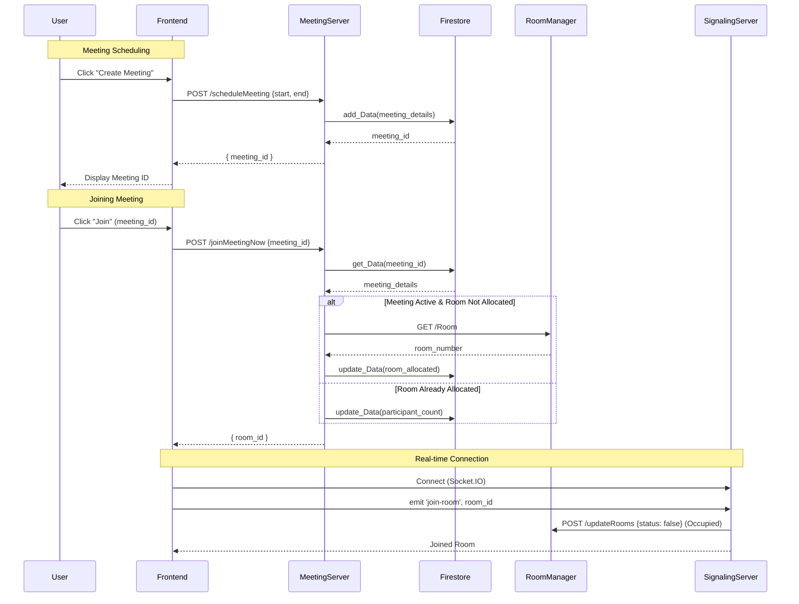

# Online Meeting Peer-to-Peer Project Description

## 1. Project Overview
The **Online Meeting Peer-to-Peer** project is a microservice-based web application designed to facilitate real-time video and audio communication between users. It leverages **WebRTC** for peer-to-peer media streaming and a set of **Node.js** microservices to handle signaling, meeting scheduling, and room management. The application aims to provide a scalable, fault-tolerant, and modular solution for online meetings, distinct from traditional monolithic architectures.

## 2. Components and Architecture

The system is composed of the following key microservices and components:

### 2.1. Frontend Application
*   **Tech Stack:** React, Vite, WebRTC.
*   **Role:** The user interface for scheduling, joining, and participating in meetings. It handles media stream capture (camera/microphone) and establishes peer-to-peer connections using WebRTC.
*   **Interactions:**
    *   Communicates with the **Signaling Server** via WebSockets for connection establishment.
    *   Communicates with the **Meeting Server** via HTTP REST APIs to schedule and join meetings.
    *   Interacts with **Firebase** for authentication.

### 2.2. Signaling Server (`server.cjs`)
*   **Tech Stack:** Node.js, Socket.IO.
*   **Role:** Facilitates the initial handshake between peers (WebRTC signaling). It exchanges session descriptions (SDP) and ICE candidates so peers can connect directly.
*   **Key Responsibilities:**
    *   Handling `join-room`, `signal`, and `disconnect` events.
    *   Notifying the **Room Manager** when a user joins or leaves a room to update room availability.
    *   Broadcasting `new-peer` and `peer-disconnected` events to participants in a room.

### 2.3. Meeting Server (`meet_server.cjs`)
*   **Tech Stack:** Node.js, Express.
*   **Role:** Manages the lifecycle of meetings. It handles scheduling new meetings and validating requests to join existing ones.
*   **Key Responsibilities:**
    *   `POST /scheduleMeeting`: Creates a new meeting entry in the database.
    *   `POST /joinMeetingNow`: Validates meeting time and ID. If valid, it requests an available room from the **Room Manager** (if not already allocated) and returns the room ID.
    *   Interacts with **Firestore** to store and retrieve meeting details.

### 2.4. Room Manager (`rooms_manager.cjs`)
*   **Tech Stack:** Node.js, HTTP.
*   **Role:** Manages the pool of available virtual rooms. It ensures that meetings are assigned to valid, available rooms and tracks their occupancy status.
*   **Key Responsibilities:**
    *   `GET /Room`: Returns the ID of the first available room.
    *   `POST /updateRooms`: Updates the status of a room (occupied/free) based on updates from the Signaling Server.
    *   Maintains an in-memory state of room availability (e.g., 5 rooms in the current implementation).

### 2.5. Database (Firestore)
*   **Tech Stack:** Firebase Firestore.
*   **Role:** Persists meeting data, including start/end times, participant counts, and allocated room IDs.

## 3. Design Rationale

The project adopts a **Microservices Architecture** to address several key engineering goals:

*   **Scalability:** Each component can be scaled independently. For instance, if the signaling load increases (many users joining), the Signaling Server can be scaled horizontally without duplicating the Meeting Server logic.
*   **Fault Isolation:** A failure in the Room Manager or Meeting Server does not immediately crash the active Signaling Server, potentially allowing ongoing calls to continue (though new joins might fail).
*   **Technology Heterogeneity:** Different services use protocols best suited for their task (WebSockets for real-time signaling, HTTP/REST for transactional meeting management).
*   **Maintainability:** Smaller, focused codebases (`server.cjs`, `meet_server.cjs`, etc.) are easier to understand, test, and maintain compared to a large monolithic server.

### Design Patterns Used
*   **Observer Pattern:** Used in the Signaling Server (Socket.IO) to react to real-time events like `join-room`.
*   **Repository Pattern:** Encapsulated in `firestore_Database.cjs` to abstract database operations.
*   **Singleton Pattern:** Used for Firebase initialization and potentially for database connections.
*   **Rate Limiter:** (Recommended/Implied) To prevent abuse of signaling and meeting APIs.

## 4. System Diagram

The following diagram illustrates the high-level architecture and communication flow between containers.



## 5. Sequence Diagrams

### 5.1. Meeting Creation & Joining Flow
This sequence describes how a user schedules a meeting and subsequently joins it.



### 5.2. Peer-to-Peer Communication Flow
This sequence details the WebRTC signaling process once users are in the same room.

```mermaid
sequenceDiagram
    participant PeerA
    participant SignalingServer
    participant PeerB

    PeerA->>SignalingServer: join-room(roomID)
    PeerB->>SignalingServer: join-room(roomID)
    
    Note right of PeerB: Peer B joins after Peer A
    SignalingServer->>PeerA: emit 'new-peer' (PeerB_ID)
    
    PeerA->>PeerA: Create WebRTC Offer
    PeerA->>SignalingServer: emit 'signal' {to: PeerB, data: Offer}
    SignalingServer->>PeerB: emit 'signal' {from: PeerA, data: Offer}
    
    PeerB->>PeerB: Create WebRTC Answer
    PeerB->>SignalingServer: emit 'signal' {to: PeerA, data: Answer}
    SignalingServer->>PeerA: emit 'signal' {from: PeerB, data: Answer}
    
    Note over PeerA, PeerB: ICE Candidates Exchanged similarly via Signaling Server
    
    PeerA<-->>PeerB: Direct P2P Media Stream (Video/Audio)
```
