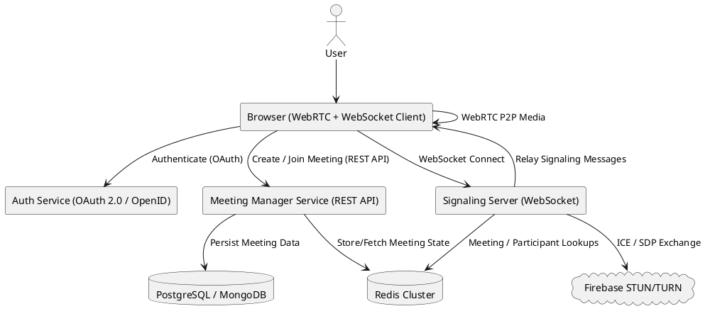

# 📖 Project README: **P2P Online Meeting Platform using WebRTC**

---

## 📌 Overview

This project is an **online meeting platform** designed for small group meetings (5–6 participants per meeting) using **WebRTC peer-to-peer (P2P)** connections for real-time audio/video communication.  
Our system is built to support **large-scale concurrent meetings** while ensuring user authentication, meeting management, and ephemeral meeting state storage for efficient and scalable operation.

We’ve adopted a **Microservices Architecture** with lightweight APIs and Redis caching for optimal performance and scalability. The signaling process for WebRTC is handled via a dedicated signaling service, with **Firebase STUN/TURN servers** used for NAT traversal.

---

## 🎯 Core Features  

- User Authentication using **OAuth 2.0 / OpenID Connect**
- WebRTC-based peer-to-peer video/audio calls (5-6 participants per room)
- Create and join meetings via unique Meeting IDs
- Ephemeral meeting state management using **Redis**
- Persistent meeting metadata storage in **Database (MongoDB)**
- Meeting duration tracking and auto-expiry
- Host privileges (mute/remove participants)
- Load-balanced and horizontally scalable **Signaling Service**
- Failover-safe WebRTC connection setup via **Firebase STUN/TURN servers**
- Microservices APIs for meeting management, authentication, and signaling coordination

---

## 🏁 How to Run Locally ? 
- first you need install npm packages by running this command in terminal
```bash
npm i
```
- then run this command to start the application
```bash
npm start
```
- now open your browser and go to localhost:3000 to see the application.
- also you need to create certificates to run the application locally. you can use this [link](https://letsencrypt.org/getting-started/) to get started.

## 🛠️ Tech Stack

| Category         | Technology             |
|:----------------|:----------------------|
| Frontend         | JavaScript (React, WebRTC APIs, WebSockets) |
| Authentication   | OAuth 2.0 / OpenID Connect |
| Backend          | Node.js |
| Signaling Server | WebSocket server (Node.js / Golang) |
| Data Storage     | PostgreSQL / MongoDB |
| Cache / Session Store | Redis Cluster |
| NAT Traversal    | Firebase STUN/TURN servers |
| Load Balancer    | Nginx / HAProxy |
| Deployment       | Docker, Kubernetes (K8s) |

---

## 📐 System Architecture  

The system is built using a **Microservices Architecture**, with clear separation of concerns across the following services:

### 🔸 Authentication Service  
Handles user login, token generation (JWT), and token validation via OAuth 2.0 / OpenID Connect.

---

### 🔸 Meeting Manager Service  
- Creates and manages meetings  
- Tracks meeting durations and expiration  
- Updates Redis with current meeting and participant state  
- Stores persistent meeting metadata in the database  

APIs:
- `POST /meeting/create`
- `POST /meeting/join`
- `GET /meeting/{id}`
- `DELETE /meeting/{id}`

---

### 🔸 Signaling Server (WebSocket)
- Manages WebRTC signaling exchange (SDP offers/answers, ICE candidates)
- Uses Redis for fast lookups of meeting and participant connection details
- Relays signaling messages between clients until P2P connection is established

---

## 🌐 Workflow

### 1️⃣ User Authentication  
- User authenticates via OAuth 2.0 / OpenID Connect provider  
- Receives JWT for session authorization  

---

### 2️⃣ Create Meeting  
- Authenticated user sends a **create meeting request**
- Meeting Manager generates a unique meeting ID  
- Stores meeting metadata in **database**  
- Adds ephemeral meeting entry in **Redis**  
- Returns meeting ID to the user  

---

### 3️⃣ Join Meeting  
- User provides meeting ID  
- Meeting Manager checks Redis for validity  
- Updates participant list in **Redis** and **Database**

---

### 4️⃣ Signaling  
- Clients establish a WebSocket connection with the Signaling Server  
- Exchange SDP/ICE candidates until P2P WebRTC connection is established  
- STUN/TURN servers (via Firebase) assist in NAT traversal  

---

### 5️⃣ Meeting Management  
- Host privileges:
  - Mute other users
  - Remove participants

- Track meeting duration via Meeting Manager
- Auto-expire meetings after duration, removing from Redis and Database  

---

## 📝 Data Storage Plan

**Redis**
- Active meetings and participant session details
- Meeting TTL (Time-to-live)
- Ephemeral signaling info

**Database (PostgreSQL/MongoDB)**
- User metadata  
- Meeting metadata  
- Historical meeting logs (optional)

---

## 📶 Network Components

| Component         | Role                     |
|:-----------------|:-------------------------|
| Redis             | Fast cache for active meetings and connections |
| Firebase STUN/TURN | NAT traversal for P2P connectivity |
| WebSocket Signaling | WebRTC signaling and peer discovery |
| Database          | Persistent meeting records |
| Load Balancer     | Distributes signaling server traffic |

---

## 📊 Deployment Architecture Diagram (PlantUML)




---

## 📦 API Endpoints Overview

| Method | Endpoint               | Description                        |
|:--------|:-----------------------|:------------------------------------|
| POST   | `/auth/login`            | Authenticate via OAuth/OpenID      |
| POST   | `/meeting/create`        | Create a new meeting               |
| POST   | `/meeting/join`          | Join an existing meeting           |
| GET    | `/meeting/{id}`          | Fetch meeting details              |
| DELETE | `/meeting/{id}`          | End/Remove a meeting               |

---

## ⚙️ Future Improvements (Post-MVP)

- Host reassignment on disconnect (dynamic host switching)
- Chat messaging within meetings  
- Recording support via server-side mix/minimal relay
- Meeting logs and statistics dashboard  
- Optional push notification service for meeting reminders  

---

## 📌 Conclusion  

This project is a robust, scalable, real-time online meeting platform leveraging **P2P WebRTC** connections and a **Microservices-based backend** to efficiently handle large numbers of concurrent meetings. By combining Redis caching, WebSocket signaling, and modern authentication standards, it ensures smooth, reliable, and secure communication.

---
